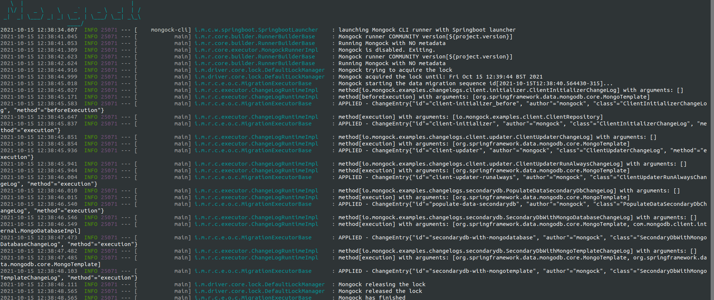

# Mongock Example for: springboot + spring data

## Example scope
- How to use Mongock with Springboot and Spring data MongoDB
- How to use Mongock with both alternative approaches: autoconfiguration and builder
- How to use a secondary database(in this case MongoDB, but could be any) to retrieve data(shouldn't be used as migration-target database)
- How to use the CLI to run the migration

## Mongock Autoconfiguration vs Builder
Mongock offers these two configuration options with Springboot. Only one of them should be enabled at a time.

This example contains two SpringBootApplication classes, one for each approach.
> :bulb: The `@ComponentScan` annotation with the exclusion is only added in order to allow these two configurations living  in the same project without sabotaging each ther.

### Autoconfiguration
It's the recommended approach, reflected in the `SpringbootAutoconfigurationApp` class and activated by default in this example(the generated jar will use this approach).

It takes the configuration properties from the file `resources/application.yml` and it's configured in the class `MongockAutoConfiguration`


### Builder
Implemented in the class `SpringbootBuilderApp`.

The configuration properties are provided programmatically with the builder as it's shown in the configuration class `MongockBuilderConfiguration`

## CLI

To use the CLI you don't need to do anything else in this application, just install the CLI in two very easy steps and pass the application as a parameter, so it can take the migration and the dependencies.

### Install CLI
<!--  Remove this section with just the documentation link: https://www.mongock.io/cli-->
1. Download the latest version of the **mongock-cli-LATEST_VERSION.zip** from [](https://repo.maven.apache.org/maven2/io/mongock/mongock-cli/)
2. Unzip it

### MongockCliConfiguration
You can optionally use the `@MongockCliConfiguration` to tell the CLI explicitly the configuration classes to load, instead of loading the entire context. For example, you don't want your MongockEvent listeners to be processed with the CLI, like in this case.

```java
@MongockCliConfiguration(sources = {
        MongoDbCommonConfiguration.class,
        MongockAutoConfiguration.class
})
//...
public class SpringBootSpringDataAdvanced {
//...
}
```

### Run the migration with the CLI

<!--  Remove this section with just the documentation link: https://www.mongock.io/cli/operations#migrate-->
1. Execute `mvn clean package` inside your application folder.
2. Open a terminal and locate it inside the unzipped folder from the installation step
3. Execute `./mongock migrate -aj YOUR_PROJECT_FOLDER/target/springboot-springdata-advanced-1.0-SNAPSHOT.jar`

> :bulb: The Mongock CLI requires an uber application jar. **Luckily for Springboot users, this is provided by the framework out of the box**


The output should look similar to this:




